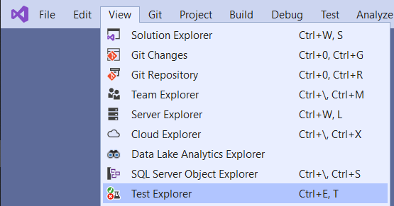

# Fancy Calculator

This is a beginner level task for practicing AutoCode tasks management. Translations: [Russian](README-RU.md).

## Get the Project

* [Open a project from your remote repository](https://docs.microsoft.com/en-us/visualstudio/get-started/tutorial-open-project-from-repo) or [get your local copy](https://docs.microsoft.com/en-us/azure/devops/repos/git/clone#clone-from-another-git-provider) with Visual Studio.

## Complete the Task

1. [Build the solution](https://docs.microsoft.com/en-us/visualstudio/ide/building-and-cleaning-projects-and-solutions-in-visual-studio).
    * Click on the menu item - _Build\Build Solution_.
    * Or use the default keyboard shortcut - _Ctrl+Shift+B_.

1. Open the [Test Explorer](https://docs.microsoft.com/ru-ru/visualstudio/test/run-unit-tests-with-test-explorer) view.
    * Click on the menu item - _View\Test Explorer_.
    * Or use the default keyboard shortcut - _Ctrl+E, T_.

1. Run all unit tests. There are 20 unit tests in the project, at least 15 unit tests in Test Explorer should be "red".
    * Click on the menu item - _Test\Run All Tests_.
    * Or use the defaul keyboard shortcut - _Ctrl+R, A_.

1. Double click on "Plus_WithOneAndOne_ReturnsTwo" unit test. Visual Studio will open the code editor window for [OperationsTests.cs](FancyCalc.Tests/OperationsTests.cs) file, and will navigate you to the unit test code.
1. Navigate to "Operations.Plus" method code.
    * Right click on the method name "Plus" in line 13, and click on "Go to Implementation" menu item.
    * Or click on the method name "Plus" in line 13, and use the default shortcut _Ctrl+F12_.
    * Or click on the method name "Plus" in line 13 pressing the _Ctrl_ key.
1. Visual Studio will open the editor window for [Operations.cs](FancyCalc/Operations.cs) file, and will navigate you to the method code.
1. Go to line 10.
    * Use cursor keys.
    * Or use the default shortcut - _Ctrl+G_, press 10, and press Enter key.
1. Uncomment the current line.
    * Use the default shortcut - _Ctrl+K, Ctrl+U_.
1. Go to the next line - line 11.
1. Comment the current line.
    * Use the default shortcut - _Ctrl+K, Ctrl+C_.
1. Open the Test Explorer view, run all unit tests. All "Plus" unit tests and "Plus_WithOneAndOne_ReturnsTwo" unit test are "green" now.
1. Inspect "Minus" unit tests in the test list. Only one unit test in "green", the others are "red".
1. Navigate to the unit test code, and then navigate to the "Minus" method code in the [Operations.cs](FancyCalc/Operations.cs) file.
1. Fix the "Minus" method code according to the TODO comment.
1. Open the Test Explorer view, click on the "Minus (4)" line, and run all "Minus" unit tests right clicking on the menu item.
1. Navigate to the "Multiply" unit test, and then to the "Multiply" method code in the [Operations.cs](FancyCalc/Operations.cs) file.
1. Add a breakpoint to line 23.
    * Click on the gutter for line 23.
    * Or use the default shortcut - _F9_.
1. Open the Test Explorer view, and run the "green" "Multiply(0, 0)" unit test in the debug mode.
    * Right click on the "Minus" unit test, and click on the "Debug" menu item.
    * Or use the default shortcut - _Ctrl+R, T_.
1. Trace the program execution.
    * Click on the "Debug\Step Over" menu item.
    * Or use the default shortcut - _F10_.
    * Or use the menu bar icon in the "Debug" panel.
1. Inspect the "result" variable.
    * Hover the "result" variable name on line 24 with your mouse.
1. Remove the breakpoint on line 23, and add a breakpoint to line 24.
1. Run the "red" "Multiply(0, 1)" unit test in the debug mode again.
1. Inspect the "result" variable.
1. Continue the program execution.
    * Click on the "Debug\Continue" menu item.
    * Or use the default shortcut - _F5_.
    * Or use the menu bar icon in the "Debug" panel.
1. Fix the "Multiply" method code according to the TODO comment.
1. Open the Test Explorer view and run all "Multiply" unit tests again. "Multiply" unit tests should be "green" now.
1. Open the Test Explorer view and run all "Sum" unit tests. Some unit tests should be "red".
1. Add a breakpoint to line 30.
1. Run one of the failed unit tests in the debug mode.
1. Trace the program execution to find the problem.
1. Fix the code.
1. Open the Test Explorer view and run all "Sum" unit tests. "Sum" unit tests should be "green" now.
1. Run all unit tests and make sure all of them are "green".

## Fix Compiler Issues

Additional style and code checks are enabled for the projects in this solution to help you maintaining consistency of the project source code and avoiding silly mistakes. [Review the Error List](https://docs.microsoft.com/en-us/visualstudio/ide/find-and-fix-code-errors#review-the-error-list) in Visual Studio to see all compiler warnings and errors.

If a compiler error or warning message is not clear, [review errors details](https://docs.microsoft.com/en-us/visualstudio/ide/find-and-fix-code-errors#review-errors-in-detail) or google the error or warning code to get more information about the issue.

Also, you can use [Sonar rule knowledge database](https://rules.sonarsource.com/csharp) for searching more detailed information regarding detected Sonars' issues.

## Save Your Work

* [Rebuild your solution](https://docs.microsoft.com/en-us/visualstudio/ide/building-and-cleaning-projects-and-solutions-in-visual-studio) in Visual Studio.
* Check out the [Error List window](https://docs.microsoft.com/en-us/visualstudio/ide/reference/error-list-window) for compiler errors and warnings. If you have any of those issues, **fix the issues** and rebuild the solution again.
* [Run all unit tests with Test Explorer](https://docs.microsoft.com/en-us/visualstudio/test/run-unit-tests-with-test-explorer) and make sure there are **no failed unit tests**. Fix your code to [make all your unit tests GREEN](https://stackoverflow.com/questions/276813/what-is-red-green-testing).
* Review all your changes **before** saving your work.
    * Open the "Changes" view in [Team Explorer](https://docs.microsoft.com/en-us/visualstudio/ide/reference/team-explorer-reference).
    * Right click on a modified file.
    * Click on "Compare with Unmodified" menu item to open a comparison window.
* [Stage your changes](https://docs.microsoft.com/en-us/azure/devops/repos/git/commits#stage-your-changes) and [create a commit](https://docs.microsoft.com/en-us/azure/devops/repos/git/commits#create-a-commit).
* Share your changes by [pushing them to a remote repository](https://docs.microsoft.com/en-us/azure/devops/repos/git/pushing).

## See also

* Visual Studio
  * [First look at the Visual Studio Debugger](https://docs.microsoft.com/en-us/visualstudio/debugger/debugger-feature-tour)
  * [Quickstart: Debug with C# or Visual Basic using the Visual Studio debugger](https://docs.microsoft.com/en-us/visualstudio/debugger/quickstart-debug-with-managed)
  * [Tutorial: Learn to debug C# code using Visual Studio](https://docs.microsoft.com/en-us/visualstudio/get-started/csharp/tutorial-debugger)
  * [Navigate through code with the Visual Studio debugger](https://docs.microsoft.com/en-us/visualstudio/debugger/navigating-through-code-with-the-debugger)
  * [Default keyboard shortcuts in Visual Studio](https://docs.microsoft.com/en-us/visualstudio/ide/default-keyboard-shortcuts-in-visual-studio)
